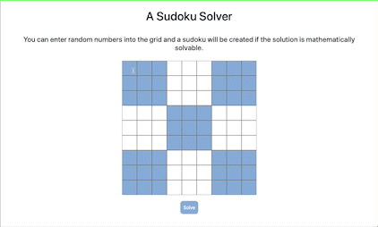

# sudoku_solver
A quick javascript sudoku solver

To run and play with this code:
- clone the repository locally
- create an environment file (.env)
    - fill it with a rapid api key for the https://rapidapi.com/sosier/api/solve-sudoku/ api and call it `RAPID_API_KEY`
- go to the folder with the package.json file in it
- run `npm install`
- run `node sudoku/server.js`
- then open the `index.html` that can be found in `~/sudoku`

